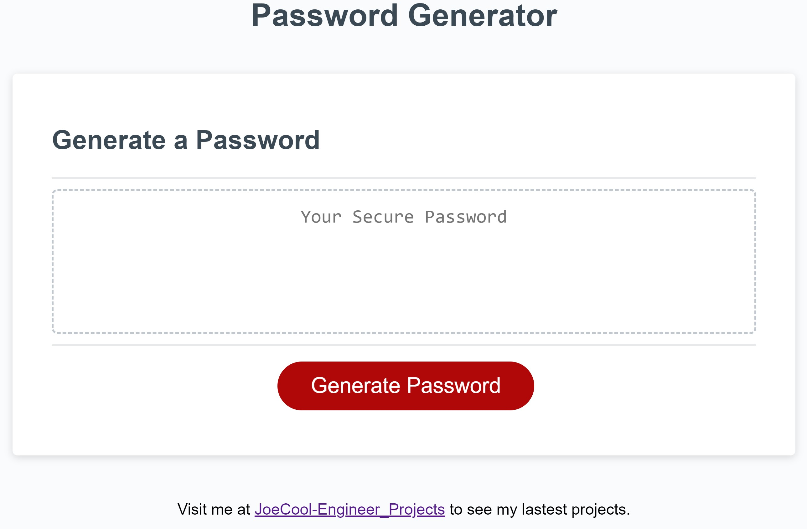

# JoeCool_Password_Generator

## Description

As part of week 3 challenge, I'm tasked with providing password based off a user's input which defines the criteria the password shall have. This challenge will provide the basic fundamentals for javascript such as functions, case statements, and loops, while interacting with a basic html document. 

## Installation

No installation is required. This is a web based tool and can be accessed through [JoeCool Password Generator](https://joecool-engineer.github.io/JoeCool_Password_Generator/).

## Usage

Visit the [JoeCool Password Generator](https://joecool-engineer.github.io/JoeCool_Password_Generator/) and click on **"Generate Password"**. This will begin a series of prompts, alerts, and confirmation questions which will generate a password of your liking in dashed box above the button. 

## Credits

The main page and styling was provided by University of Arizona coding bootcamp. However, the functionality was provided by JoeCool himself. Enjoy!

## Badges

